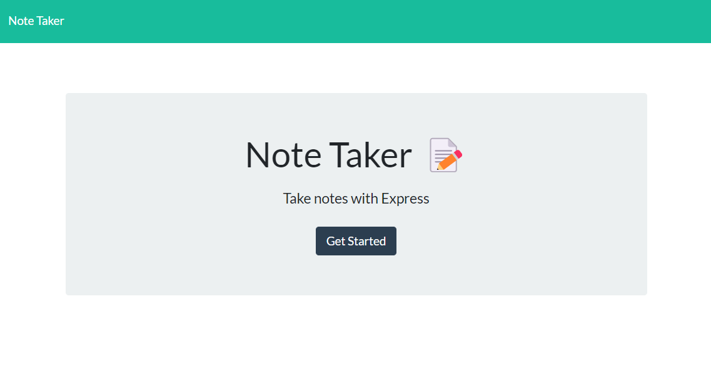
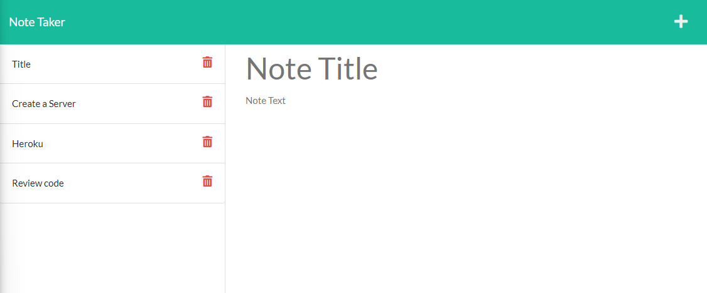

# Note Taker

## Description

AS A small business owner
I WANT to be able to write and save notes
SO THAT I can organize my thoughts and keep track of tasks I need to complete

## Table of Contents

If your README is long, add a table of contents to make it easy for users to find what they need.

- [Usage](#usage)
- [Screenshots](#screenshots)
- [Questions](#questions)

## Usage

Use note taker to write, save and delete notes.

<a href="https://note-taker-sen.herokuapp.com/">Deployed App</a>

## Screenshots

## Questions

**How to reach me**

- <a href="https://github.com/joesen-dev">Github</a>
- Email senjoseph90@gmail.com
